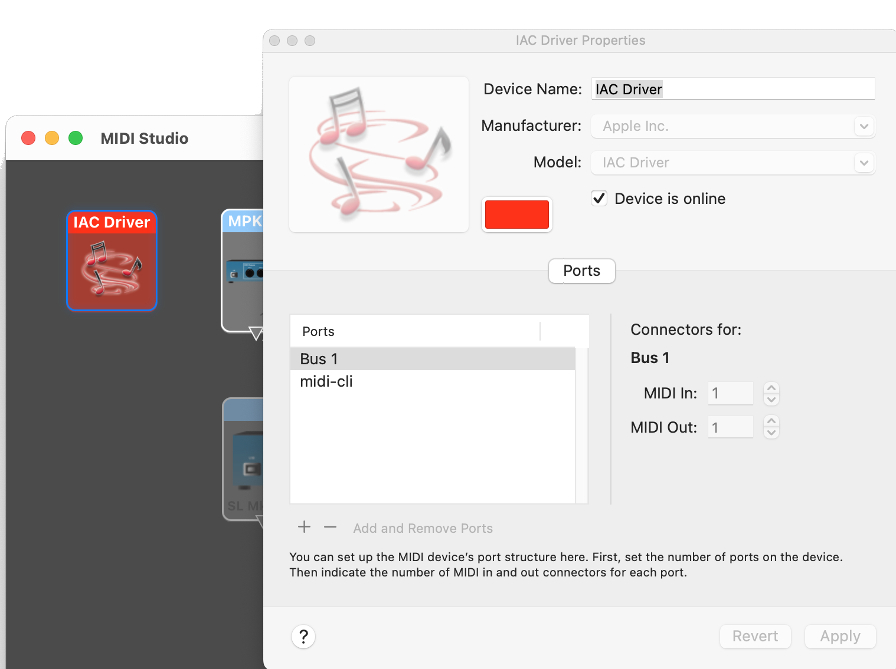
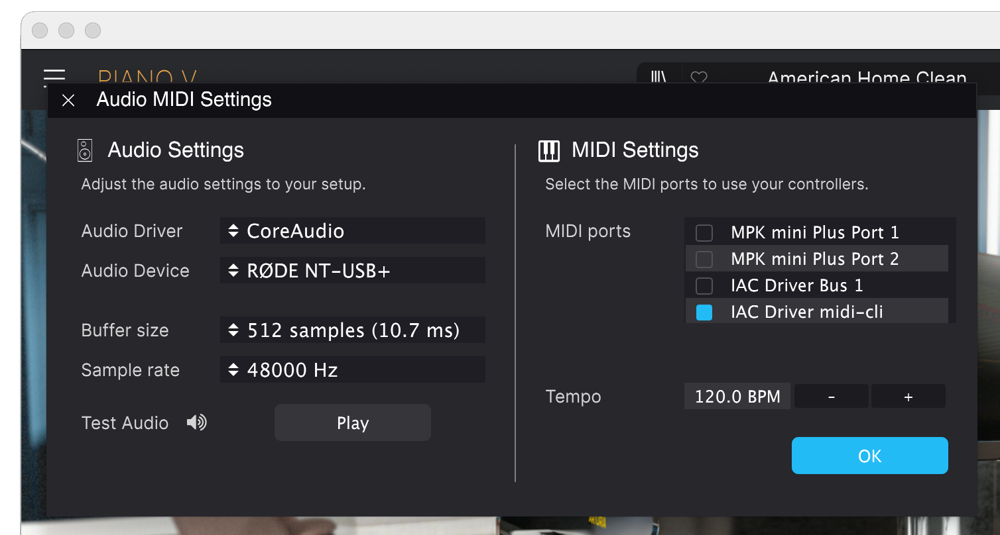

### Mac Setup

* In the "Audio MIDI Setup" app, enable the "IAC Driver"
* Optionally (but useful), add a new bus named "midi-cli"
  - See [Apple's docs](https://support.apple.com/guide/audio-midi-setup/) for more info
* Make sure the instrument / DAW is listening
  - This step is different for any sort of program, but is often required as many don't listen by default to all MIDI devices that are present.

#### Setup Screenshots

IAC setup example:

Instrument setup example:

